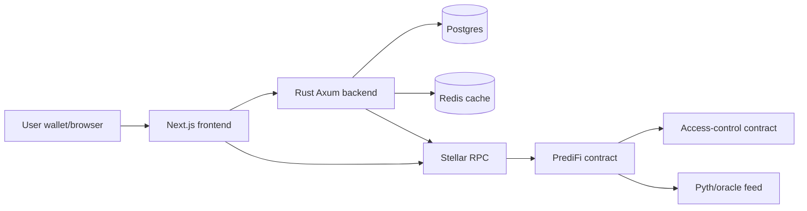
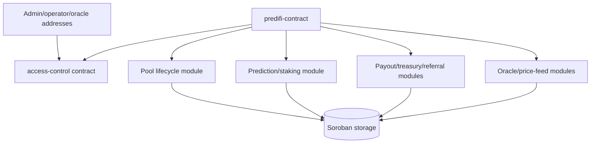
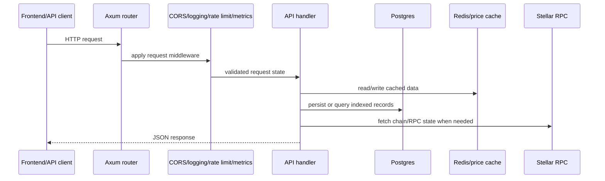
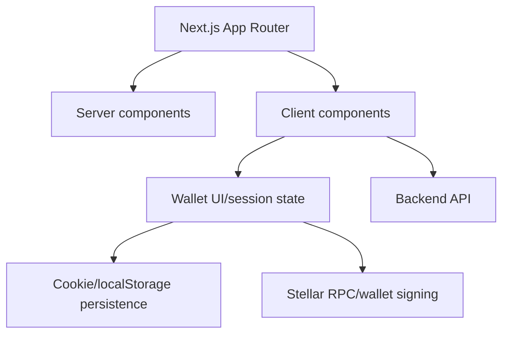
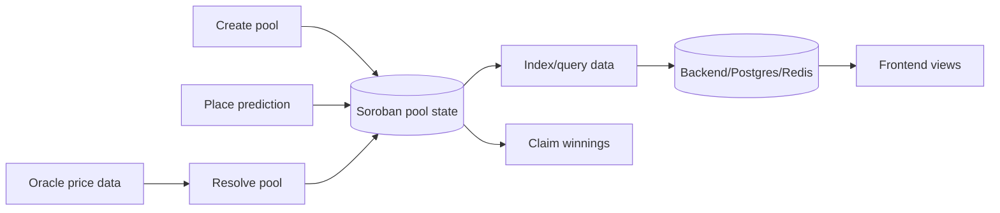

# PrediFi Architecture Overview

PrediFi is a Stellar/Soroban prediction-market system made up of Soroban smart contracts, a Rust backend API, a Next.js frontend, and supporting infrastructure for persistence, caching, indexing, and monitoring.

## System Components

- `contract/`: Soroban contracts for pool lifecycle, staking, payouts, access control, oracle-driven resolution, treasury, referrals, and safe arithmetic.
- `backend/`: Rust/Axum API that exposes application endpoints, validates requests, stores indexed data in Postgres, caches frequently read data, and checks Stellar RPC health.
- `frontend/`: Next.js/TypeScript app that renders the user experience, connects wallet interactions, and persists lightweight client preferences.
- Infrastructure: Docker Compose, Terraform, CI workflows, Redis, Postgres, and observability components.

## High-Level System

## Smart Contract Architecture

The contract layer keeps authorization separate from protocol logic. The main PrediFi contract owns market state and delegates role checks to the access-control contract.

Core interactions:

1. Admin deploys and initializes `access-control`, then assigns operator and oracle roles.
2. Admin initializes `predifi-contract` with the access-control address, treasury, fee basis points, and timing parameters.
3. Pool creators create markets with bounded options, stake limits, and end times.
4. Users place predictions with whitelisted tokens.
5. Operators or oracle flows resolve pools after the configured resolution delay.
6. Winners claim payouts; protocol and referral fees are routed through treasury/referral logic.

## Backend API Flow

The backend is an Axum service. It builds application state from configuration, database connections, Redis/cache clients, metrics, and Stellar RPC settings.

Health endpoints check database reachability, Redis availability, the price cache, and Stellar RPC `getHealth`. The API stores indexed prediction-market data in Postgres and uses Redis/price cache paths to keep common reads fast.

## Frontend State Management

The frontend uses the Next.js App Router. Above-the-fold marketing components are loaded eagerly, while heavier below-the-fold sections are dynamically imported to keep initial rendering lean.

Client-side persistence reads cookies first and falls back to localStorage for browser privacy modes that block cookie writes. Wallet-facing UI owns user interaction state, while backend and Stellar RPC calls provide market and chain data.

## End-to-End Data Flow

The contract is the source of truth for pool state, stakes, resolution, and payouts. The backend improves queryability and operational visibility, while the frontend presents current market state and submits signed user actions.

## Operational Boundaries

- Contract state changes require signed Soroban transactions and role checks where applicable.
- Backend state is derived/indexed application data and should not be treated as the source of truth for settlement.
- Frontend persistence is convenience state only; it must not be trusted for authorization or settlement.
- Oracle-based resolution depends on configured price-feed freshness, confidence, and registered oracle settings.
