# PrediFi Architecture Overview

PrediFi is a Stellar/Soroban prediction-market system made up of Soroban smart contracts, a Rust backend API, a Next.js frontend, and supporting infrastructure for persistence, caching, indexing, and monitoring.

## Table of Contents

- [Technology Stack](#technology-stack)
- [Repository Layout](#repository-layout)
- [High-Level System](#high-level-system)
- [Smart Contract Architecture](#smart-contract-architecture)
- [Storage Architecture](#storage-architecture)
- [Backend API Flow](#backend-api-flow)
- [Frontend State Management](#frontend-state-management)
- [End-to-End Data Flow](#end-to-end-data-flow)
- [Prediction Lifecycle](#prediction-lifecycle)
- [Security and Access Control](#security-and-access-control)
- [Deployment and Infrastructure](#deployment-and-infrastructure)
- [Monitoring and Observability](#monitoring-and-observability)
- [Operational Boundaries](#operational-boundaries)

## Technology Stack

| Layer | Technology | Purpose |
|-------|-----------|---------|
| Blockchain | Stellar + Soroban (SDK 23.4.1, Protocol 23) | Smart contract execution, settlement |
| Contracts | Rust (`no_std`) + `soroban-sdk` | Pool lifecycle, staking, payouts, oracle |
| Backend | Rust + Axum + Tokio | REST API, indexing, health checks |
| Database | PostgreSQL (SQLx) | Indexed pool/prediction data, referrals, stats |
| Cache | Redis + in-memory `PriceCache` / `PoolCache` | Hot reads, rate limiting, session data |
| Frontend | Next.js 15 + TypeScript + SWR + Tailwind | User-facing market UI, wallet integration |
| Infra | Docker Compose, Terraform (AWS), GitHub Actions | Local dev, cloud provisioning, CI |
| Observability | Prometheus metrics, tracing (OTel), Horizon events | Metrics, logs, contract event streaming |

## Repository Layout

```
predifi/
├── contract/
│   ├── contracts/
│   │   ├── predifi-contract/   # Main market contract
│   │   │   └── src/
│   │   │       ├── lib.rs              # Types, errors, DataKey, events
│   │   │       ├── pool.rs             # Pool creation & lifecycle
│   │   │       ├── prediction.rs       # place_prediction / claim paths
│   │   │       ├── price_feed.rs       # Full oracle adapter (Pyth)
│   │   │       ├── price_feed_simple.rs# Simplified tuple adapter
│   │   │       ├── oracle.rs           # Oracle whitelist & callbacks
│   │   │       ├── payouts.rs          # Pure fee/payout math
│   │   │       ├── treasury.rs         # Protocol fee accrual / withdrawal
│   │   │       ├── referral.rs         # Referral volume & reward routing
│   │   │       ├── safe_math.rs        # Overflow-checked arithmetic
│   │   │       └── admin.rs            # Pause, fee, treasury, whitelist ops
│   │   ├── access-control/     # Role management (Admin/Operator/Oracle)
│   │   └── predifi-errors/     # Shared error enum (native + Soroban)
│   └── Cargo.toml
├── backend/
│   └── src/
│       ├── server.rs / lib.rs  # Axum router, health, CORS, metrics
│       ├── config.rs           # Env-driven configuration
│       ├── db/                 # Postgres pools, predictions, referrals, metrics
│       ├── routes/             # API v1 handlers (pools, predictions, etc.)
│       ├── price_cache.rs      # In-memory oracle price snapshot
│       ├── pool_cache.rs       # In-memory pool snapshot
│       ├── redis_cache.rs      # Redis client & helpers
│       ├── rate_limit.rs       # Tiered rate limiting
│       ├── jwt.rs              # JWT auth & validation
│       └── telemetry.rs        # OTel / tracing setup
├── frontend/
│   ├── app/                    # Next.js App Router (server + client components)
│   ├── components/             # Reusable UI, wallet, market components
│   ├── lib/
│   │   ├── api/                # Typed backend client (pools, predictions)
│   │   └── hooks/              # SWR hooks (usePools, etc.)
│   └── providers/              # SWRProvider, wallet context
├── docs/                       # Architecture, API ref, deployment guides
├── docker/ & docker-compose.yml
└── terraform/                  # AWS modules, environment configs
```

## High-Level System

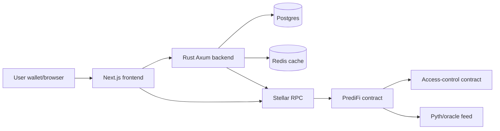

Request paths:

- **Read path (fast):** `Frontend → Backend → (Redis/PoolCache → Postgres)` — cached pool lists, stats, leaderboards. Falls back to Stellar RPC for on-chain truth when needed.
- **Write path (settlement):** `Frontend → Stellar RPC → PrediFi contract` — signed Soroban transactions for `create_pool`, `place_prediction`, `resolve_pool`, `claim_winnings`. Backend indexes the resulting events.

## Smart Contract Architecture

The contract layer keeps authorization separate from protocol logic. The main PrediFi contract owns market state and delegates role checks to the access-control contract.

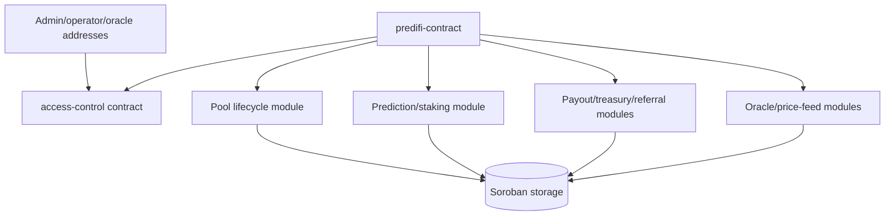

### Module Responsibilities

| Module | File | Responsibility |
|--------|------|---------------|
| **Pool** | `pool.rs` | `create_pool`, `update_pool_description`, `close_staking`, `cancel_pool`, `resolve_pool` (operator voting), `emergency_cancel_pool` |
| **Prediction** | `prediction.rs` | `place_prediction` (staking, cooldown, limits, referrals), `claim_winnings` / `claim_refund` / `batch_claim_winnings`, `get_user_predictions` |
| **Price Feed (full)** | `price_feed.rs` | `init_oracle`, `update_price_feed`, `is_price_valid`, `evaluate_price_condition`, `resolve_pool_from_price`, `cleanup_expired_feeds` — Pyth-style `PriceFeed` / `PriceCondition` / `OracleConfig` structs |
| **Price Feed (simple)** | `price_feed_simple.rs` | Tuple-backed variant `(feed_pair, target_price, operator, tolerance_bps)` with deviation guard (5×) and permissionless cleanup |
| **Oracle** | `oracle.rs` | Oracle whitelist, `oracle_resolve` callback, confidence & staleness checks |
| **Payouts** | `payouts.rs` | Pure fee/payout math (`calculate_claim_payout`, `calculate_referral_amount`, `calculate_odds_bps`) — protocol-favor rounding, INV-4 enforcement |
| **Treasury** | `treasury.rs` | Fee accrual accounting, `withdraw_treasury` (admin only) |
| **Referral** | `referral.rs` | `Referrer(user, pool)` / `ReferredVolume` tracking, referral cut on claim |
| **Safe Math** | `safe_math.rs` | `SafeMath::percentage`, `proportion`, `calculate_share` with checked arithmetic |
| **Admin** | `admin.rs` | `init`, `pause`/`unpause`, `set_fee_bps` (timelocked), `set_treasury`, `add/remove_token_whitelist`, `upgrade_contract` |
| **Access Control** | `access-control/` | Role registry (Admin=0, Operator=1, Oracle=3); `has_role` cross-contract call |

Core interactions:

1. Admin deploys and initializes `access-control`, then assigns operator and oracle roles.
2. Admin initializes `predifi-contract` with the access-control address, treasury, fee basis points, and timing parameters.
3. Pool creators create markets with bounded options, stake limits, and end times.
4. Users place predictions with whitelisted tokens.
5. Operators or oracle flows resolve pools after the configured resolution delay.
6. Winners claim payouts; protocol and referral fees are routed through treasury/referral logic.

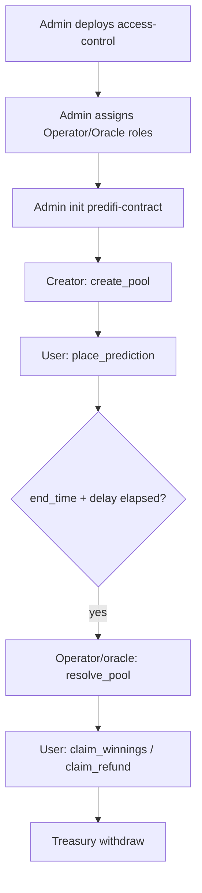

## Storage Architecture

Soroban offers three storage tiers; PrediFi uses them as follows:

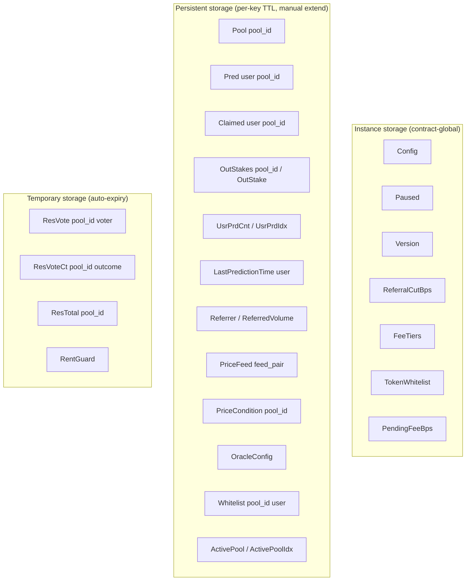

Key patterns:

- **TTL management:** `extend_persistent` / `bump_ttl` is called on every read/write of persistent keys; `RentGuard` uses temporary storage for reentrancy protection.
- **Batch vs individual stakes:** `OutStakes(pool_id) -> Vec<i128>` (preferred) with fallback to `OutStake(pool_id, outcome)` for backward compatibility.
- **Index structures:** `UsrPrdCnt` + `UsrPrdIdx` for pagination; `ActivePool` / `ActivePoolIdx` for active-pool enumeration; `CatPoolCt` / `CatPoolIx` per category.
- **Price feed registry:** `PriceFeedList: Vec<Symbol>` tracks all pairs for `cleanup_expired_feeds`.

## Backend API Flow

The backend is an Axum service. It builds application state from configuration, database connections, Redis/cache clients, metrics, and Stellar RPC settings.

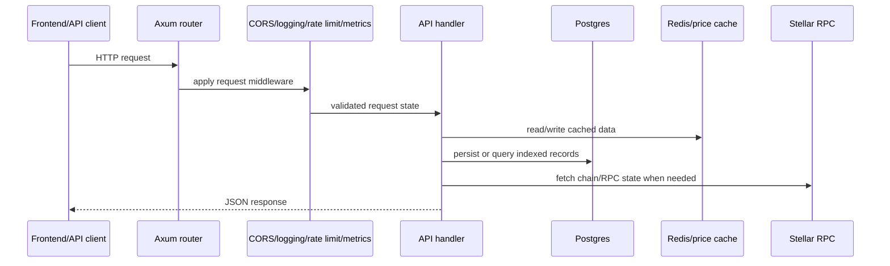

### Request Lifecycle

1. **Routing:** `lib.rs:build_router` mounts `/`, `/health`, `/metrics`, `/api/*`, and Swagger UI. `routes::router` / `router_with_db` wire versioned handlers.
2. **Middleware stack (outer → inner):** CORS (`build_cors`) → `LoggingLayer` (request logger + Prometheus) → rate limiting (`rate_limit`) → JWT auth where required.
3. **AppState:** `Arc<Config>` + `PriceCache` + `PoolCache` + `RedisCache` + optional `PgPool` + `Metrics` + `EventBus`. Cloned per request via Axum `State`.
4. **Handlers:** Validate inputs (`validated_types`), hit cache first (`PoolCache` / `Redis`), fall back to Postgres, optionally call Stellar RPC for chain truth, then return JSON.
5. **Health:** `GET /health` checks Postgres (`SELECT 1`), Redis (`PING`), `PriceCache` (non-empty), and Stellar RPC `getHealth` with retry/backoff. Reports per-dependency status plus `SERVICE_UNAVAILABLE` if any check fails.

Health endpoints check database reachability, Redis availability, the price cache, and Stellar RPC `getHealth`. The API stores indexed prediction-market data in Postgres and uses Redis/price cache paths to keep common reads fast.

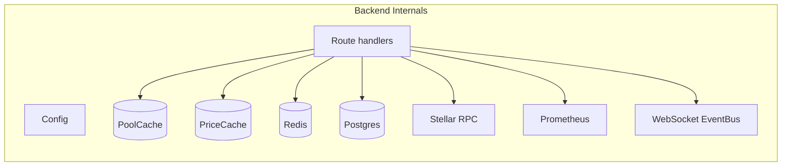

## Frontend State Management

The frontend uses the Next.js App Router. Above-the-fold marketing components are loaded eagerly, while heavier below-the-fold sections are dynamically imported to keep initial rendering lean.

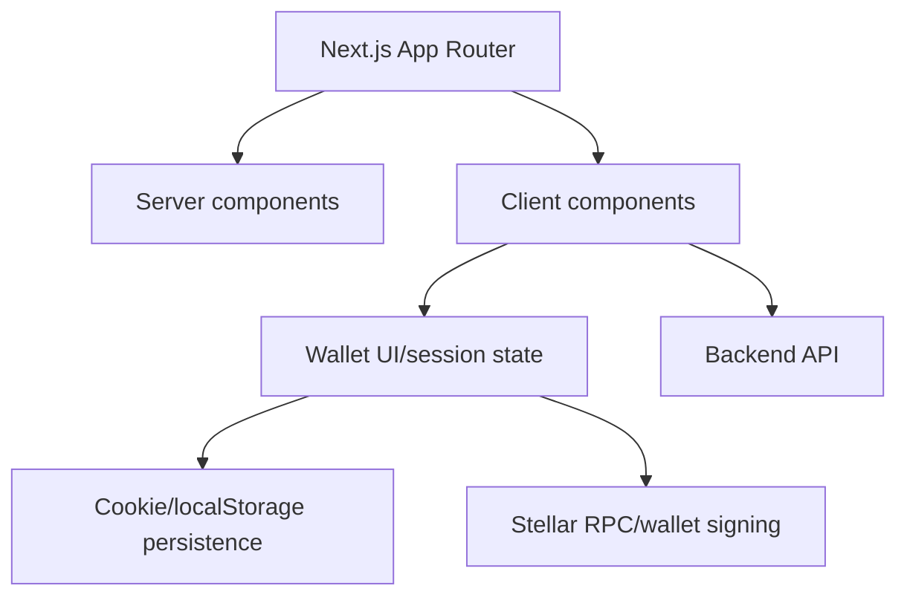

### Layers

| Layer | Mechanism | Details |
|-------|-----------|---------|
| **Server components** | Next.js App Router | Static rendering, SEO, initial data fetch |
| **Client components** | React + SWR | `SWRProvider` (no revalidate on focus/reconnect, deduped), `usePools()` → `lib/api/pools.ts` typed client, `NEXT_PUBLIC_API_BASE_URL` |
| **Wallet / session** | Freighter + context | Signing, `require_auth` flows, session persistence |
| **Persistence** | Cookies → localStorage fallback | Reads cookies first, falls back to localStorage for privacy modes that block cookies |
| **Signing** | Stellar SDK + Freighter | `contract.call("place_prediction", ...)` via `TransactionBuilder` + `simulateTransaction` before submit |

Client-side persistence reads cookies first and falls back to localStorage for browser privacy modes that block cookie writes. Wallet-facing UI owns user interaction state, while backend and Stellar RPC calls provide market and chain data.

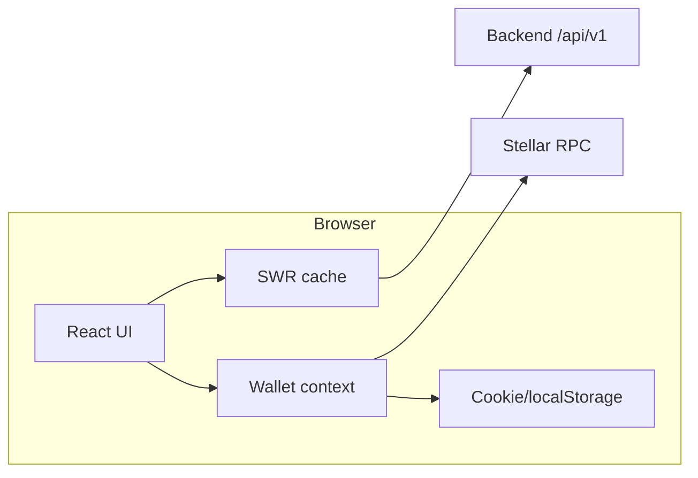

## End-to-End Data Flow

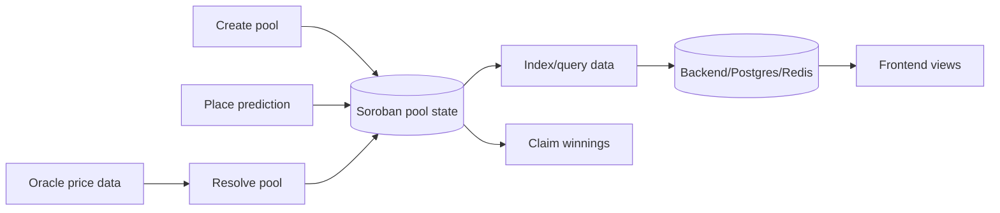

The contract is the source of truth for pool state, stakes, resolution, and payouts. The backend improves queryability and operational visibility, while the frontend presents current market state and submits signed user actions.

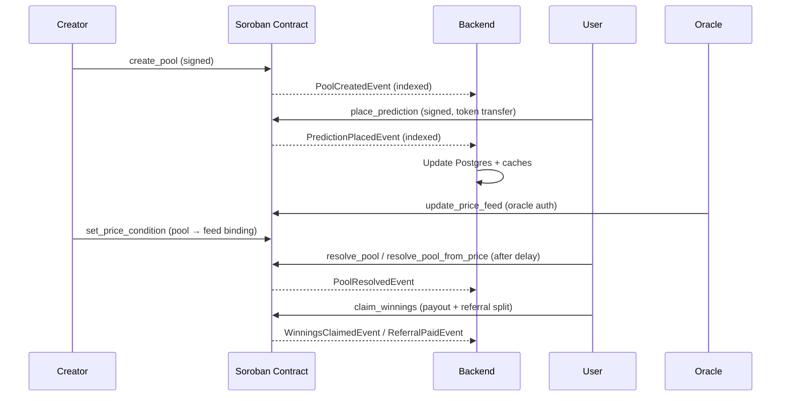

## Prediction Lifecycle

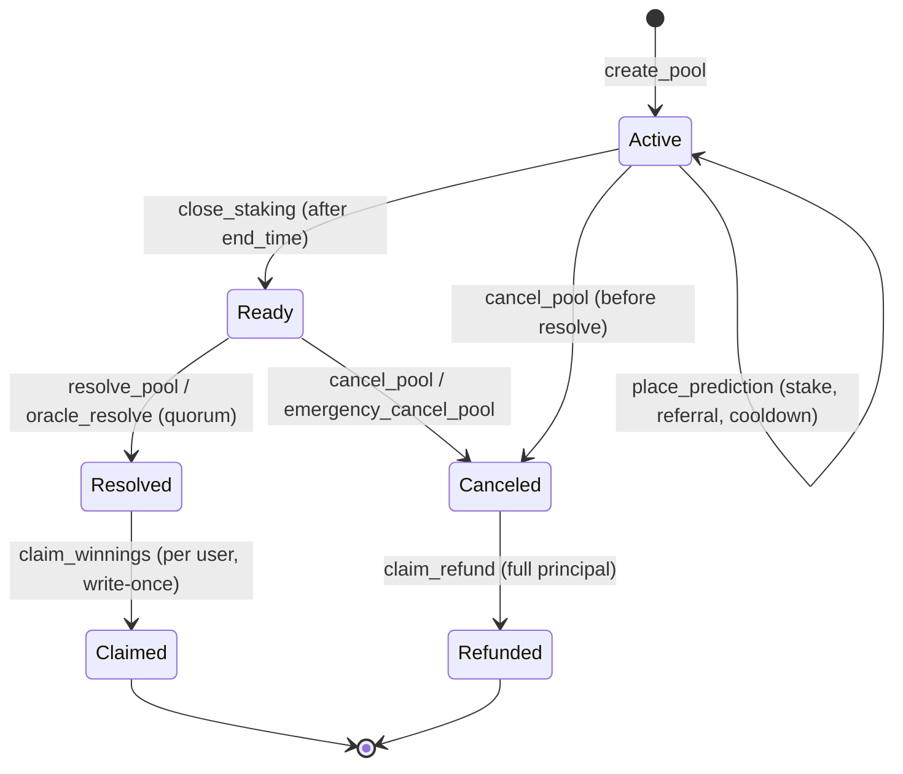

## Security and Access Control

| Concern | Mechanism |
|---------|-----------|
| **Roles** | `access-control` contract: Admin (0), Operator (1), Oracle (3). `require_role` cross-calls `has_role`. Moderator (2) reserved for disputes (#595). |
| **Auth** | `require_auth` on all value-moving / privileged entry points; `mock_all_auths` in tests |
| **Reentrancy** | `RentGuard` (temporary storage) around `place_prediction`, `claim_winnings`, `claim_refund`, `withdraw_treasury` |
| **Arithmetic** | `SafeMath` with checked `add`/`sub`/`mul`/`div`, `RoundingMode::ProtocolFavor` for fees |
| **Invariants** | INV-1 (total = Σ outcome stakes) … INV-8 (end_time > creation) — enforced in handlers & `payouts.rs` |
| **Input validation** | `min_stake`/`max_stake`/`max_total_stake`, `options_count` bounds, `outcome < options_count`, fee BPS ≤ 10_000, whitelist checks |
| **Oracle safety** | Staleness (age + expiry), confidence ratio, 5× deviation guard (simple adapter), manual fallback |
| **Pause** | `Paused` instance flag — blocks all state-mutating ops; `is_contract_paused` getter + `PauseEvent`/`UnpauseEvent` |

## Deployment and Infrastructure

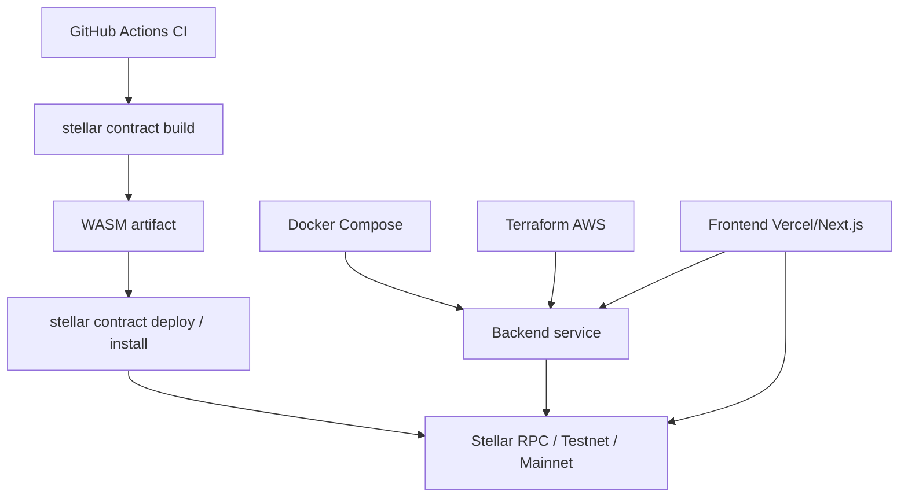

- **Local dev:** `docker-compose.yml` brings up Postgres + Redis + backend + frontend; `contract/Makefile` wraps `stellar contract build` / `cargo test`.
- **Contract deploy:** `stellar contract build` → `stellar contract deploy --wasm target/.../predifi_contract.wasm --source ACCOUNT --network testnet/mainnet`; TTL extended via `stellar contract extend`.
- **Backend deploy:** Docker image → AWS via Terraform modules (`terraform/modules/`); env-driven `Config` (RPC URL, DB URL, Redis URL, CORS origins, log level).
- **Frontend deploy:** Vercel / Next.js standalone; `NEXT_PUBLIC_API_BASE_URL` points at the backend.

## Monitoring and Observability

| Signal | Source | Consumer |
|--------|--------|----------|
| **Prometheus metrics** | `backend/src/metrics.rs` + `LoggingLayer` | `GET /metrics` scraped by Prometheus |
| **Health** | `GET /health` (DB, Redis, PriceCache, RPC) | Load balancer / uptime monitor |
| **Tracing** | `telemetry.rs` (OTel when `TELEMETRY_ENABLED=true`, else JSON fmt) | Collector / Grafana |
| **Contract events** | `events.rs` (`PredictionPlaced`, `PoolResolved`, `WinningsClaimed`, `ReferralPaid`, alert topics `unauthorized_*`, `double_claim_attempt`, `contract_paused_alert`, `high_value_prediction`) | Horizon event streaming → SIEM / PagerDuty |
| **Price feed freshness** | `price_feed::is_price_valid` / `PriceCache` | Backend price-cache health gate |

## Operational Boundaries

- Contract state changes require signed Soroban transactions and role checks where applicable.
- Backend state is derived/indexed application data and should not be treated as the source of truth for settlement.
- Frontend persistence is convenience state only; it must not be trusted for authorization or settlement.
- Oracle-based resolution depends on configured price-feed freshness, confidence, and registered oracle settings.
- `PriceFeedList` growth is bounded by `cleanup_expired_feeds` — operators should schedule periodic cleanup (daily/weekly).
- Fee changes are timelocked (`PendingFeeBps` + `effective_at`) — `set_fee_bps` queues, `apply_fee_bps` commits after delay, `cancel_fee_proposal` aborts.
