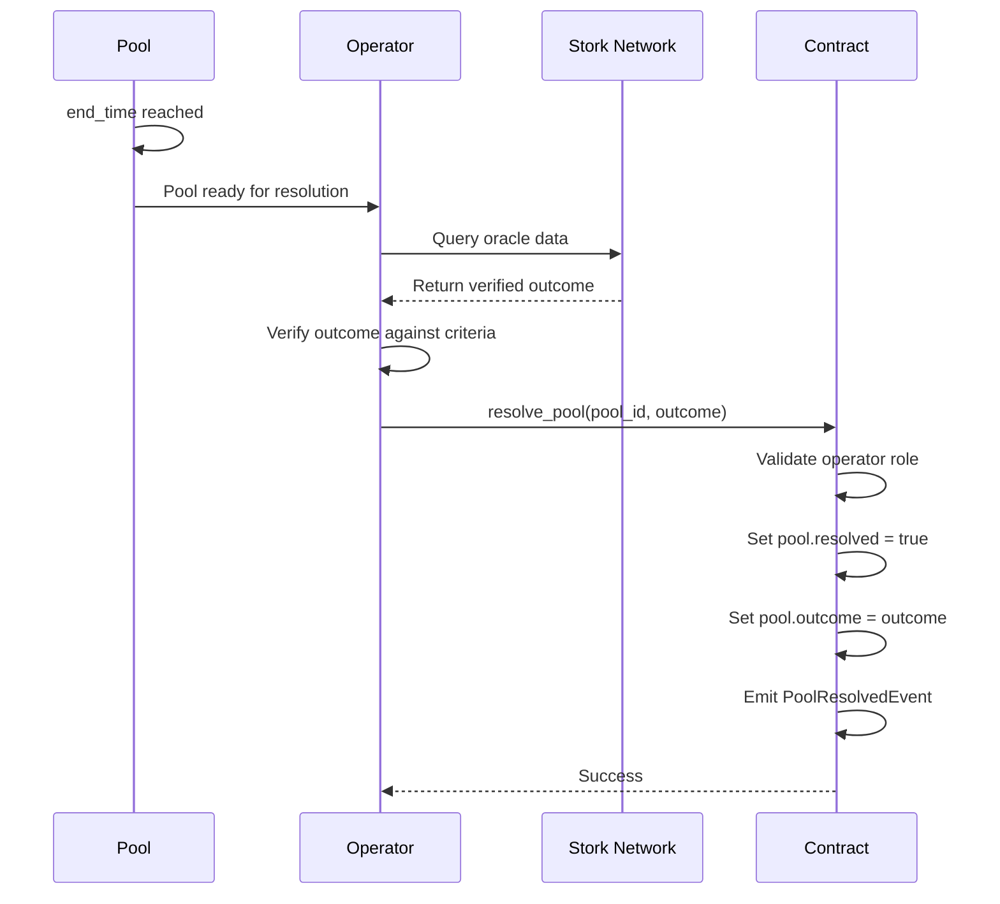

# Verifiable Oracles

PrediFi uses **Stork Network** to ensure objective, verifiable market outcomes. This document explains how oracle resolution works and how to verify outcomes.

## Overview

PrediFi markets resolve based on verifiable, on-chain data from Stork Network oracles. This eliminates the need for trusted third parties and ensures outcomes are objective and auditable.

## Oracle Resolution Flow



## Stork Network Integration

Stork Network provides decentralized oracle services for Stellar/Soroban:

1. **Data Sources**: Aggregates data from multiple trusted sources
2. **Verification**: Cryptographic proofs ensure data integrity
3. **On-Chain**: Outcomes are verifiable on-chain via contract calls

### Querying Oracle Data

Operators query Stork Network before resolving pools:

```typescript
// Example: Query Stork Network for outcome
async function queryOracle(poolId: number, metadataUrl: string) {
  // Parse metadata URL to get oracle query parameters
  const oracleParams = parseMetadata(metadataUrl);
  
  // Query Stork Network
  const response = await fetch(`https://stork.network/api/query`, {
    method: 'POST',
    body: JSON.stringify({
      pool_id: poolId,
      query: oracleParams.query,
      timestamp: oracleParams.end_time
    })
  });
  
  const data = await response.json();
  return data.outcome; // Returns outcome index (0, 1, 2, etc.)
}
```

## Resolution Process

### Step 1: Pool End Time Reached

Once `pool.end_time` passes, the pool is closed to new predictions:

```rust
// Pool is closed when:
env.ledger().timestamp() >= pool.end_time
```

### Step 2: Operator Queries Oracle

An operator (with role 1) queries Stork Network for the verified outcome:

```typescript
const outcome = await queryOracle(poolId, pool.metadata_url);
```

### Step 3: Operator Resolves Pool

The operator calls `resolve_pool()` with the verified outcome:

```rust
contract.resolve_pool(
    env,
    operator_address,
    pool_id,
    outcome // Verified outcome from oracle
)?;
```

### Step 4: Contract Validation

The contract validates:

- Operator has role 1 (Operator role)
- Pool exists and is not already resolved
- Pool's `end_time` has passed

### Step 5: Outcome Set

Once validated, the contract:

1. Sets `pool.resolved = true`
2. Sets `pool.outcome = outcome`
3. Emits `PoolResolvedEvent`
4. Makes pool eligible for claims

## Verifying Outcomes

### On-Chain Verification

All outcomes are stored on-chain and can be verified:

```typescript
async function verifyOutcome(poolId: number) {
  const pool = await contract.call('get_pool', {
    pool_id: nativeToScVal(poolId, { type: 'u64' })
  });
  
  if (!pool.resolved) {
    throw new Error('Pool not yet resolved');
  }
  
  return {
    resolved: pool.resolved,
    outcome: pool.outcome,
    resolvedAt: pool.resolved_at // If available
  };
}
```

### Off-Chain Verification

You can verify outcomes against Stork Network data:

```typescript
async function verifyAgainstOracle(poolId: number, contractOutcome: number) {
  const oracleOutcome = await queryOracle(poolId);
  
  if (oracleOutcome !== contractOutcome) {
    throw new Error('Outcome mismatch between contract and oracle');
  }
  
  return true; // Verified
}
```

## Oracle Data Sources

Stork Network aggregates data from multiple sources:

| Source Type | Examples | Use Case |
|-------------|----------|----------|
| **APIs** | Sports APIs, Financial APIs | Real-time event data |
| **Blockchain** | Other chains, Cross-chain data | Multi-chain events |
| **Feeds** | Price feeds, News feeds | Market data |

## Security Considerations

### Operator Trust

Operators are required to have role 1, but they cannot:

- Change outcomes after resolution
- Resolve pools before `end_time`
- Manipulate oracle data (Stork Network prevents this)

### Oracle Reliability

Stork Network provides:

- **Redundancy**: Multiple data sources
- **Verification**: Cryptographic proofs
- **Transparency**: All queries are logged

### Dispute Resolution

If an outcome seems incorrect:

1. Check the `PoolResolvedEvent` for the operator
2. Verify against Stork Network data
3. Review the pool's `metadata_url` for resolution criteria
4. Contact the protocol team if discrepancies are found

## Best Practices

### For Operators

- Always verify oracle data before resolving
- Wait for sufficient confirmation from Stork Network
- Double-check outcome indices match pool structure
- Monitor for oracle updates before resolution deadline

### For Users

- Review pool `metadata_url` to understand resolution criteria
- Verify outcomes on-chain after resolution
- Check `PoolResolvedEvent` for resolution details
- Report any discrepancies immediately

## Example: Resolving a Sports Market

```typescript
// Pool: "Will Team A win the match?"
// Metadata URL contains match ID and resolution criteria

async function resolveSportsMarket(poolId: number) {
  // 1. Get pool details
  const pool = await getPool(poolId);
  
  // 2. Wait for end_time
  await waitUntil(pool.end_time);
  
  // 3. Query Stork Network for match result
  const matchResult = await queryStorkNetwork({
    type: 'sports',
    match_id: pool.metadata.match_id,
    source: 'sports_api'
  });
  
  // 4. Map result to outcome index
  // Outcome 0: "No", Outcome 1: "Yes"
  const outcome = matchResult.team_a_won ? 1 : 0;
  
  // 5. Resolve pool
  await contract.resolve_pool(
    operatorAddress,
    poolId,
    outcome
  );
}
```

## Next Steps

- Learn about [Pool Resolution](./prediction-lifecycle.md#phase-3-resolution)
- Explore [Contract Methods](./contract-reference.md#admin-functions)
- Review [Error Handling](./troubleshooting.md#oracle-errors)
