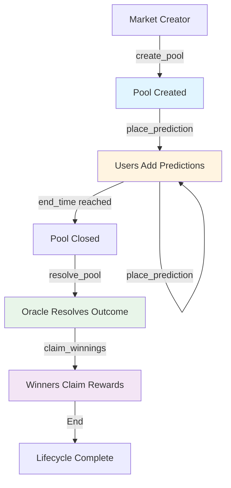
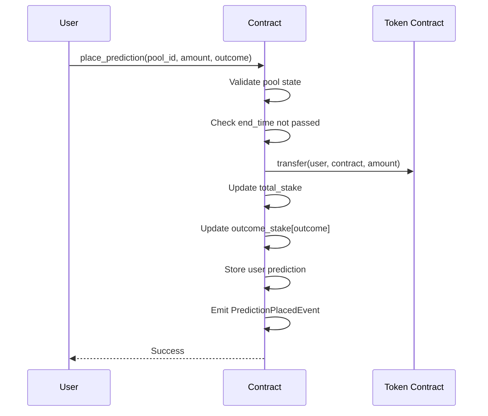
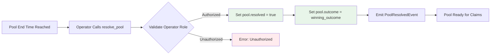
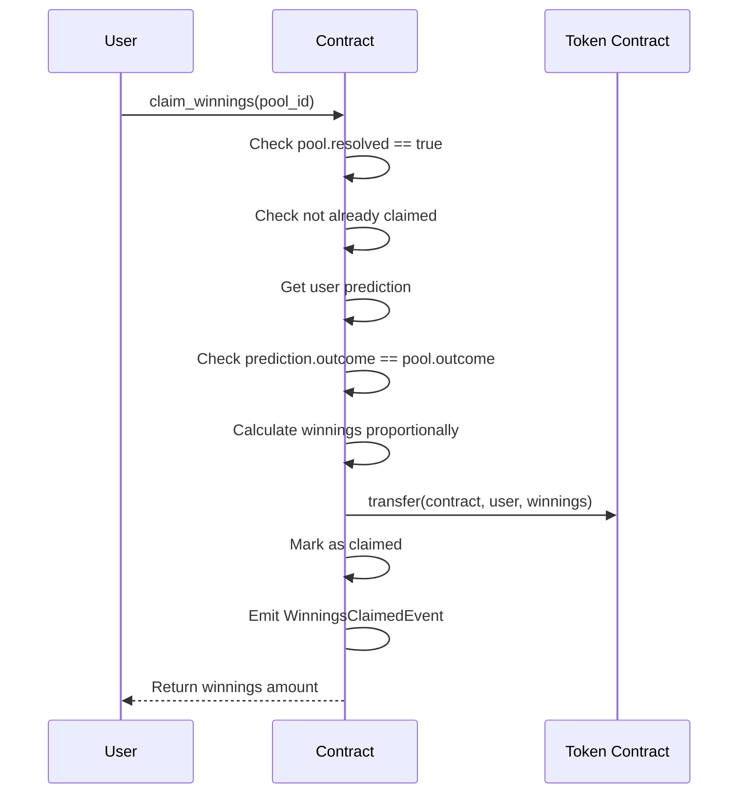
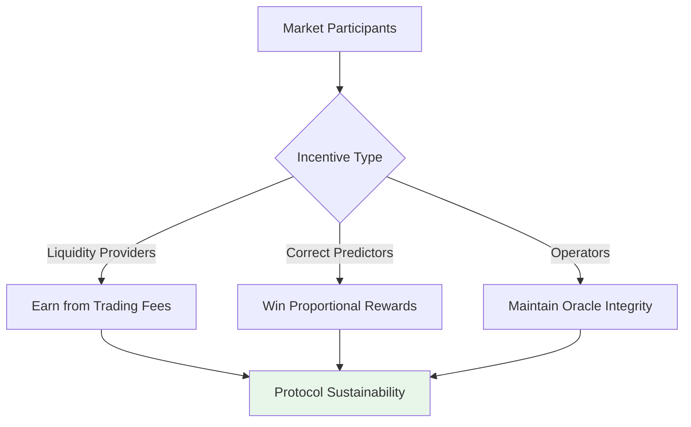
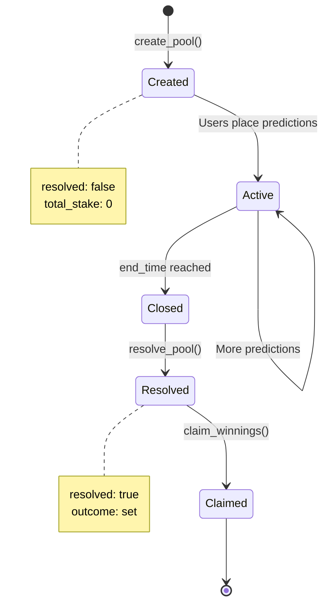

# Prediction Lifecycle

Understanding how predictions flow through the PrediFi protocol—from market creation to reward distribution.

## Overview

Every prediction market on PrediFi follows a structured lifecycle with four distinct phases:

1. **Creation** - A new market is created with defined parameters
2. **Trading** - Users place predictions and add liquidity
3. **Resolution** - The market outcome is determined via oracle
4. **Settlement** - Winners claim their rewards



## Phase 1: Market Creation

A market creator calls `create_pool()` to establish a new prediction market.

### Parameters

| Parameter | Type | Description |
|-----------|------|-------------|
| `end_time` | `u64` | Unix timestamp after which no predictions are accepted |
| `token` | `Address` | Stellar token contract address for staking |
| `description` | `String` | Human-readable event description (max 256 bytes) |
| `metadata_url` | `String` | URL to extended metadata, e.g., IPFS link (max 512 bytes) |

### Example

```rust
let pool_id = contract.create_pool(
    env,
    1735689600, // Unix timestamp
    token_address,
    String::from_str(&env, "Will Bitcoin reach $100k by 2025?"),
    String::from_str(&env, "ipfs://QmXxx...")
);
```

### What Happens

- A new `Pool` struct is created with `resolved: false`
- Pool ID is auto-incremented and returned
- `PoolCreatedEvent` is emitted for off-chain indexers
- Pool is stored in persistent storage with TTL extension

:::info
**Pool IDs**: Pool IDs are sequential integers starting from 0. Each new pool increments the counter.
:::

## Phase 2: Trading & Liquidity

Users place predictions by calling `place_prediction()` before the pool's `end_time`.

### Prediction Flow



### Key Validations

- Pool must not be resolved (`pool.resolved == false`)
- Current time must be before `pool.end_time`
- Amount must be positive (`amount > 0`)
- User must have sufficient token balance

### Staking Mechanism

When a user places a prediction:

1. **Token Transfer**: Tokens are transferred from user to contract
2. **Stake Tracking**: Total stake and outcome-specific stake are updated
3. **Prediction Storage**: User's prediction is stored with amount and outcome
4. **Indexing**: Prediction is added to user's prediction list for quick lookup

### Example

```rust
contract.place_prediction(
    env,
    user_address,
    pool_id,
    1000000000, // 100 tokens (in smallest unit)
    1 // Outcome: "Yes"
);
```

:::tip
**Multiple Predictions**: Users can place multiple predictions on the same pool, including different outcomes. Each prediction is tracked separately.
:::

## Phase 3: Resolution

After `end_time` passes, an operator (with role 1) calls `resolve_pool()` to set the winning outcome.

### Resolution Process



### Oracle Integration

PrediFi uses **Stork Network** for verifiable, objective market resolution:

1. **Oracle Query**: Off-chain service queries Stork Network for outcome data
2. **Verification**: Outcome is verified against on-chain criteria
3. **Resolution**: Operator calls `resolve_pool()` with verified outcome
4. **Immutability**: Once resolved, outcome cannot be changed

See [Verifiable Oracles](./oracles.md) for detailed oracle mechanics.

### Example

```rust
// Operator resolves pool with outcome 1 ("Yes")
contract.resolve_pool(
    env,
    operator_address,
    pool_id,
    1 // Winning outcome
)?;
```

:::warning
**Irreversible**: Once a pool is resolved, the outcome cannot be changed. Ensure oracle data is accurate before resolving.
:::

## Phase 4: Settlement & Claims

Winners call `claim_winnings()` to receive their proportional share of the total pool.

### Reward Calculation

Rewards are calculated using a **proportional distribution** model:

```
winnings = (user_stake / winning_outcome_total_stake) × total_pool_stake
```

### Claim Flow



### Example

```rust
let winnings = contract.claim_winnings(
    env,
    user_address,
    pool_id
)?;

// Returns 0 if user didn't win or already claimed
if winnings > 0 {
    println!("Claimed {} tokens", winnings);
}
```

### Edge Cases

- **Losers**: Users who predicted the wrong outcome receive 0 tokens
- **No Prediction**: Users who never placed a prediction receive 0 tokens
- **Already Claimed**: Subsequent calls return `AlreadyClaimed` error
- **Unresolved Pool**: Returns `PoolNotResolved` error

:::info
**Fee Structure**: Protocol fees are deducted from the total pool before distribution. Winners receive their proportional share of the net pool (after fees).
:::

## Incentive Alignment

The protocol aligns incentives through transparent, on-chain mechanics:



### Key Principles

1. **Transparency**: All pool data, predictions, and resolutions are on-chain
2. **Proportional Rewards**: Winners share pool proportionally to their stake
3. **No Central Authority**: Resolution relies on verifiable oracles, not trusted parties
4. **Immutability**: Once resolved, outcomes cannot be manipulated

## State Transitions



## Events Timeline

Every phase emits events for off-chain indexing and monitoring:

| Event | Phase | Emitted When |
|-------|-------|--------------|
| `PoolCreatedEvent` | Creation | Pool is created |
| `PredictionPlacedEvent` | Trading | User places prediction |
| `PoolResolvedEvent` | Resolution | Operator resolves pool |
| `WinningsClaimedEvent` | Settlement | Winner claims rewards |

See [Contract Reference](./contract-reference.md) for complete event schemas.

## Next Steps

- Learn about [Oracle Resolution](./oracles.md)
- Explore [Contract Methods](./contract-reference.md)
- Review [Error Handling](./troubleshooting.md)
